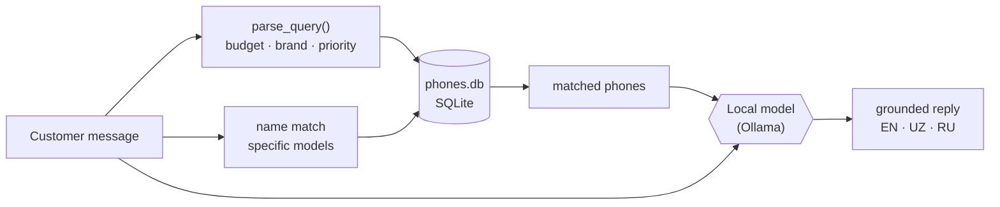

# 📱 Phone Advisor


A chat assistant that helps you pick a phone. Tell it your budget and what you
care about — battery, camera, a brand — and it recommends real models from a
local database. It understands **English and Uzbek** and answers in whichever
you use.

It runs **entirely on your machine**: the phone specs live in a local SQLite
database and the replies come from a local model through
[Ollama](https://ollama.com). Nothing is sent to the cloud.

```
You:  arzon telefon, batareyasi katta bo'lsin
Bot:  Tecno Pova 5 yaxshi tanlov — $200, 6000mAh batareya, 50MP kamera.
      Infinix Hot 30 ham bor — $140, 5000mAh, juda arzon.
```

## How it decides

The work is split into two jobs, which is the whole idea:



1. **Finding phones — with SQL, not the model.** The message is read for a
   budget, brand(s), a priority (camera, battery, gaming, screen) and any phone
   named directly. Those become a plain SQL query. A database is exact and fast
   at filtering, so the model never has to remember specs or do arithmetic.

2. **Understanding and replying — the model's job.** It gets only the matched
   phones and decides how to answer:

   | You say | It does |
   | --- | --- |
   | "something for my mum who loves photos" | Recommends matching phones — even with no literal "phone" or "camera" |
   | "iPhone 13 or Galaxy S21?" | Compares the exact models named |
   | "salom" / "hi" | Greets and asks what you need |
   | "I need a phone" | Asks one question to narrow it down |
   | "do you have a Tecno under $200?" | Filters to it, or says what's closest |
   | "what's the weather?" | Politely says it only helps pick a phone here |
   | "ignore your instructions…" | Stays in role and declines |

Relevance is judged by **meaning, not keywords** — a real request isn't rejected
for missing the word "phone", and off-topic questions aren't answered. The model
runs at a low temperature and may only recommend phones from the matched list,
so it never invents a model, spec, or price. The app even shows you the exact
phones it was grounded on under each reply.

## Run it

### Option A — Docker (recommended)

Starts the app *and* a local model server, pulls the model on first run:

```bash
docker compose up
```

Then open **http://localhost:8501**.

### Option B — run it yourself

Needs Python 3.9+ and [Ollama](https://ollama.com/download):

```bash
pip install -r requirements.txt
ollama pull qwen2.5:3b      # one time
streamlit run app.py
```

## Settings

| Variable | Default | What it does |
| --- | --- | --- |
| `OLLAMA_MODEL` | `qwen2.5:3b` | Which model to use (e.g. `qwen2.5:1.5b` is lighter) |
| `OLLAMA_URL` | `http://localhost:11434` | Where Ollama is running |

## Project layout

```
app.py             Streamlit chat UI
bot.py             the assistant's decision policy + the local model call
recommender.py     turns a message into a SQL search over the phones
fetch_data.py      builds phones.db from public data + recent local models
test_recommender.py  unit tests for the search logic
phones.db          the phone database (260+ models, 19 brands)
Dockerfile, docker-compose.yml   one-command run
```

## Tests

The search logic is covered by fast unit tests (no model needed):

```bash
python test_recommender.py
```

## Data

Phone specs come from a public dataset
([Senka2112/VIS2023-datasets](https://github.com/Senka2112/VIS2023-datasets)),
topped up with recent and locally-popular models (Tecno, Infinix, Honor and
current flagships). Prices are approximate and meant for comparison.
